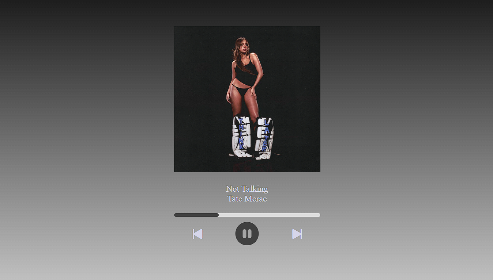
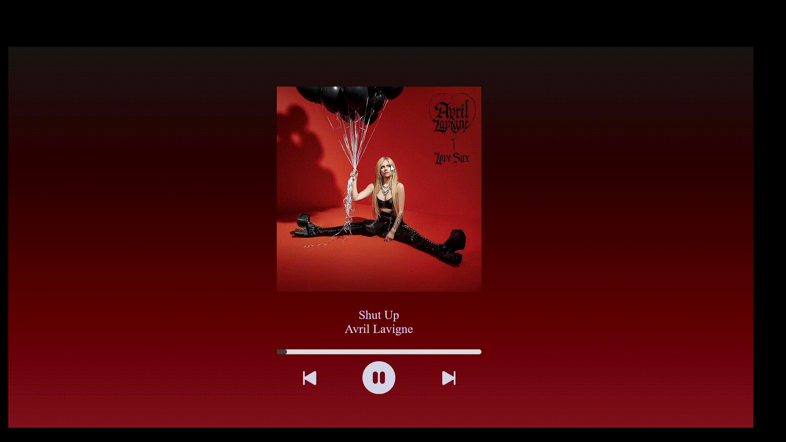

I took of the "Musics" folder because i don't know if is allowed to post something like this,
but you can create this folder on your machine and add your own musics following the script logic :)

    
    

